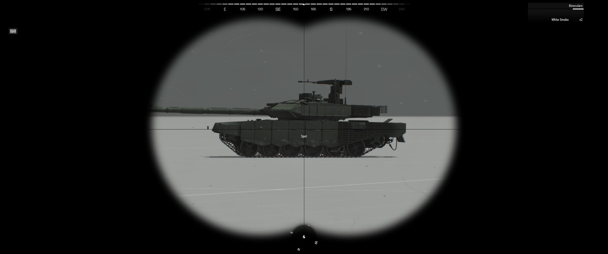

# ScoutObject
Adds scroll wheel menu action that let's the player to "scout" object under cursor (middle of the screen). The scouted object is generic typeOf object and is shown at the bottom of the screen.
Uses "cursorObject", "if" statements and "titleText" to show the object that is under the cursor.

## Requirements
Requirements to get this script to work at it's currrent state is looking through binoculars (specifically the object named "Binocular") and having player having the variable name "me" or changed accordingly in the script.

## How to use this in your own scenario
You need to copy the contents of the sqf file to the player objects init section inside of Eden editor or in the file where you initialize the playable objects.
Like stated in the requirements section, you need to change either your playable object's variable name to "me" or change the condition section of the script to say your object's variable name. Condition is located at the end of the script and has a comment to help you seek the line that it is on (line 65).

## Example pictures of the setup:

## Example pictures of the action:

