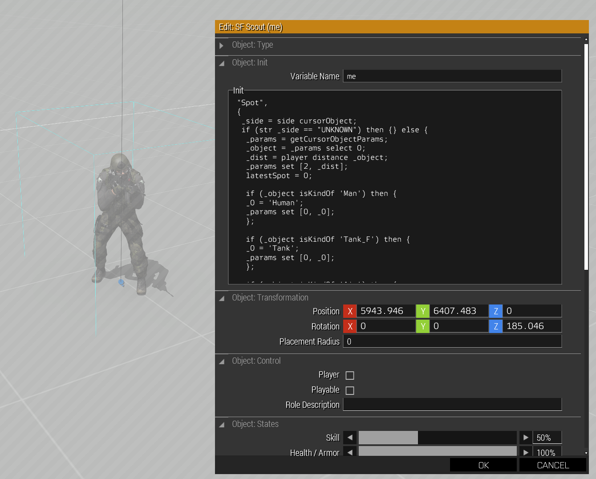
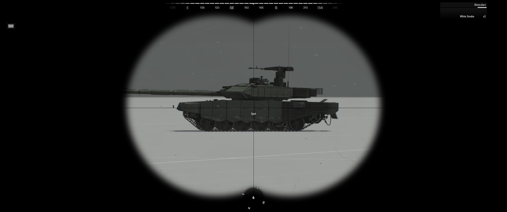
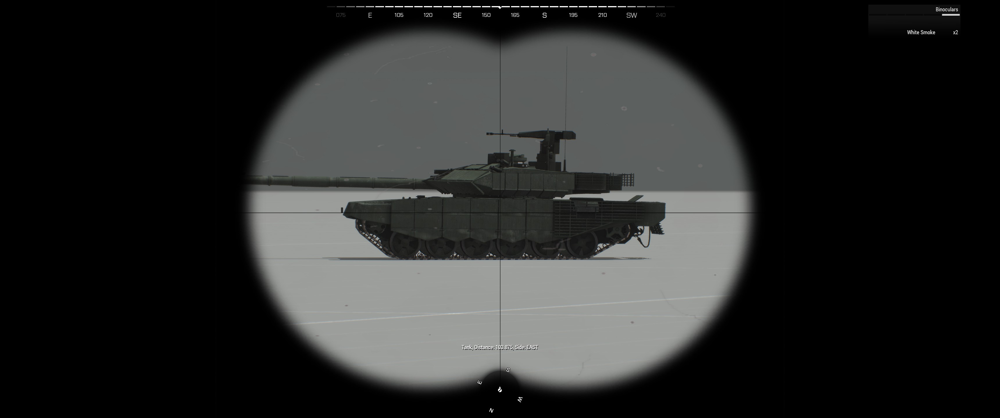

# SpotObject
Adds scroll wheel menu action that let's the player to "scout" object under cursor (middle of the screen). The scouted object is generic typeOf object and is shown at the bottom of the screen.
Uses "cursorObject", "if" statements and "titleText" to show the object that is under the cursor.

## Requirements
Requirements to get this script to work at it's current state is looking through binoculars (specifically the object named "Binocular") and playable object having the variable name "me" or changed accordingly in the script.

## How to use this script in your own scenario
You need to copy the contents of the sqf file to the player objects init field inside of Eden editor or in the file where you initialize the playable objects.
Like stated in the requirements section, you need to change either your playable object's variable name to "me" or change the condition section of the script to say your object's variable name. Condition is located at the end of the script and has a comment to help you seek the line that it is on (line 65).

## How to add something "more" to this script
I tested adding a variable to be changed to 'true' after spotting a tank for example. That would allow me to add a task which has the variable of spotting a tank to be the completion condition.

Other thing I tested is adding Artillery support via trigger using radio activation. That worked on some artillery units not all. Maybe there was a problem in the code somewhere which caused some of them to not work. I used the script of White Raven on youtube (Video named "Arma 3: Laser Designate Ai Support" link: https://www.youtube.com/watch?app=desktop&v=LmuC0ur1NyY ), though I changed the target position to be "latestSpot" variable via the spotObject script. It basically just stores the last object spotted in the "latestSpot" variable and getting it's position with "getPosATL" function.

If you would like to setup and ambush or something akin to that, you would be interested in adding a feature that also spots static objects like trees and such. This way you can see the distance to that object and easily shoot your RPG to the right distance without the need of different rangefinder. If you dislike the distance feature, you can take is off the script easily.

## Example pictures of the setup:
In this example the playable object is named "me" and is just a random unit with binoculars and the script added to the init field. "latestSpot" variable is not necessary (see How to add something "more" to this script). In the picture it shows only part of the script, it doesn't start from "Spot".

## Example pictures of the action:
Before executing the action:

Result of executing the action:

